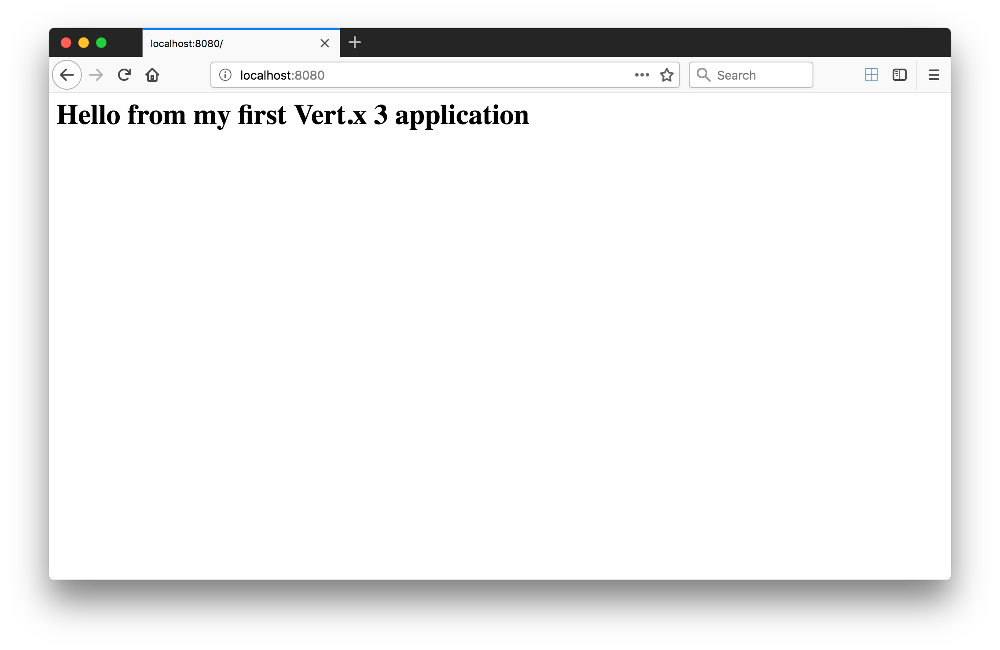

= Step 1 : Getting Started

As you may have guessed Vert.x can be downloaded from the official site: https://vertx.io/download.  But you don't need to download Vert.x: Maven or Gradle will take of that for you.  The easiest way to get started with Eclipse Vert.x is create a project.

Create a new folder for your project with a name of your choosing.  In case you need some ideas, "qcon-awesomeness," "vertx-rules," and "iheartnyc" will do.

From inside your new folder open a terminal and run:

```
mvn io.fabric8:vertx-maven-plugin:1.0.13:setup -DvertxVersion=3.5.1
```

You will be prompted to fill the GAV information.  You can accept the defaults or choose your own.

```
[INFO] Scanning for projects...
[INFO]
[INFO] ------------------------------------------------------------------------
[INFO] Building Maven Stub Project (No POM) 1
[INFO] ------------------------------------------------------------------------
[INFO]
[INFO] --- vertx-maven-plugin:1.0.13:setup (default-cli) @ standalone-pom ---
[INFO] No pom.xml found, creating it in /home/dphillips/Documents/RedHat/Workspace/rhoar-kubernetes-qcon-2018/insult-service
Set the project groupId [io.vertx.example]: com.redhat.qcon
Set the project artifactId [my-vertx-project]: insult-service
Set the project version [1.0-SNAPSHOT]: 1.0.0-SNAPSHOT
Set the vertcile class name [MainVerticle]:
[INFO] Creating verticle MainVerticle
[INFO] Creating directory /home/dphillips/Documents/RedHat/Workspace/rhoar-kubernetes-qcon-2018/insult-service/src/main/java/com/redhat/qcon
[INFO] ------------------------------------------------------------------------
[INFO] BUILD SUCCESS
[INFO] ------------------------------------------------------------------------
[INFO] Total time: 34.510 s
[INFO] Finished at: 2018-05-21T12:07:46-04:00
[INFO] Final Memory: 9M/166M
[INFO] ------------------------------------------------------------------------

```

This should create a complete Maven project with a pom.xml and a source folder, src.

Build the project by typing:

```
mvn clean package
```

Your build should complete successfully.  If it doesn't raise your hand and ask one of the Red Hat guys for help.

```
[INFO] Scanning for projects...
[INFO]
[INFO] ------------------------------------------------------------------------
[INFO] Building my-vertx-project 1.0-SNAPSHOT
[INFO] ------------------------------------------------------------------------
[INFO]
[INFO] --- maven-clean-plugin:2.5:clean (default-clean) @ my-vertx-project ---
[INFO]
[INFO] --- vertx-maven-plugin:1.0.13:initialize (vmp) @ my-vertx-project ---
[INFO]
[INFO] --- maven-resources-plugin:2.6:resources (default-resources) @ my-vertx-project ---
[INFO] Using 'UTF-8' encoding to copy filtered resources.
[INFO] Copying 0 resource
[INFO]
[INFO] --- maven-compiler-plugin:3.1:compile (default-compile) @ my-vertx-project ---
[INFO] Changes detected - recompiling the module!
[INFO] Compiling 1 source file to /Users/jeremydavis/Desktop/vertx-starter/target/classes
[INFO]
[INFO] --- maven-resources-plugin:2.6:testResources (default-testResources) @ my-vertx-project ---
[INFO] Using 'UTF-8' encoding to copy filtered resources.
[INFO] skip non existing resourceDirectory /Users/jeremydavis/Desktop/vertx-starter/src/test/resources
[INFO]
[INFO] --- maven-compiler-plugin:3.1:testCompile (default-testCompile) @ my-vertx-project ---
[INFO] Nothing to compile - all classes are up to date
[INFO]
[INFO] --- maven-surefire-plugin:2.12.4:test (default-test) @ my-vertx-project ---
[INFO] No tests to run.
[INFO]
[INFO] --- maven-jar-plugin:2.4:jar (default-jar) @ my-vertx-project ---
[INFO] Building jar: /Users/jeremydavis/Desktop/vertx-starter/target/my-vertx-project-1.0-SNAPSHOT.jar
[INFO]
[INFO] --- vertx-maven-plugin:1.0.13:package (vmp) @ my-vertx-project ---
[INFO] ------------------------------------------------------------------------
[INFO] BUILD SUCCESS
[INFO] ------------------------------------------------------------------------
[INFO] Total time: 2.420 s
[INFO] Finished at: 2018-06-22T21:24:09-04:00
[INFO] Final Memory: 20M/311M
[INFO] ------------------------------------------------------------------------
```

After your build completes you should have a shiny, new jar file in your "target" directory named "my-vertx-project-1.0-SNAPSHOT.jar."  If you entered creative values instead of accepting your the prompts your jar might have a cooler name.  For the sake of this tutorial we will assume you accepted the prompts.

You are now ready to run Eclipse Vert.x.

= Step 2 : Run Vert.x

Run the shiny, new jar file from the terminal:

```
java -jar ./target/my-vertx-project-1.0-SNAPSHOT.jar
```

You should see the following output:

```
io.vertx.core.impl.launcher.commands.VertxIsolatedDeployer
INFO: Succeeded in deploying verticle
```
Of course, the app isn't doing much yet.

= Step 3 : Launch a Web Server

When you ran your jar file it execute a class named, "MainVerticle.java."  

NOTE: Verticles are the basic unit of interaction in Vert.x.  Verticles extend AbstractVerticle and handle everything from serving JSON to functioning as an event bus.

Open the MainVerticle.java class in your IDE (it is in the io.vertx.example package in the src directory.)

[source,java]
```
package io.vertx.example;

import io.vertx.core.AbstractVerticle;

public class MainVerticle extends AbstractVerticle {

    @Override
    public void start() {

    }

}

```
MainVerticle is empty, doing nothing, and begging us to implement and HttpServer.  Swap out the void start method with the below method:

[source, java]
```
package io.vertx.example;

import io.vertx.core.AbstractVerticle;
import io.vertx.core.Future;

public class MainVerticle extends AbstractVerticle {

    @Override
    public void start(Future<Void> fut) {
        vertx
                .createHttpServer()
                .requestHandler(r -> {
                    r.response().end("<h1>Hello from my first " +
                            "Vert.x 3 application</h1>");
                })
                .listen(8080, result -> {
                    if (result.succeeded()) {
                        fut.complete();
                    } else {
                        fut.fail(result.cause());
                    }
                });
    }

}

```

As an astute reader you noticed that the example is the entire class not just the method.

Recompile by running 

```
mvn clean package
```

You should have a newer, shiny jar file in your target directory, which you can run with:

```
java -jar ./target/my-vertx-project-1.0-SNAPSHOT.jar
```
You should get the same message as before, but the result is more fun.  Open a browser and go to http://localhost:8080.  You should see the message, "Hello from my first Vert.x 3 application."



